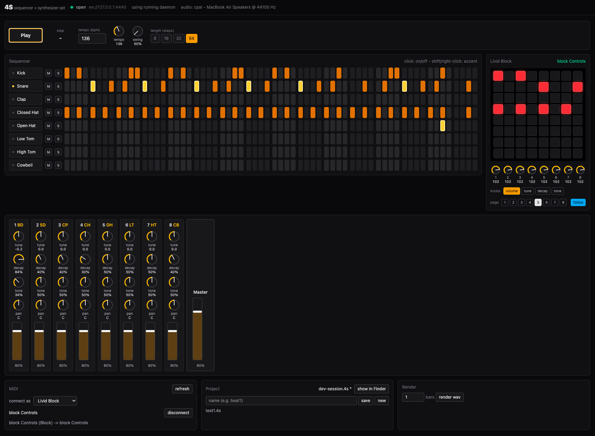
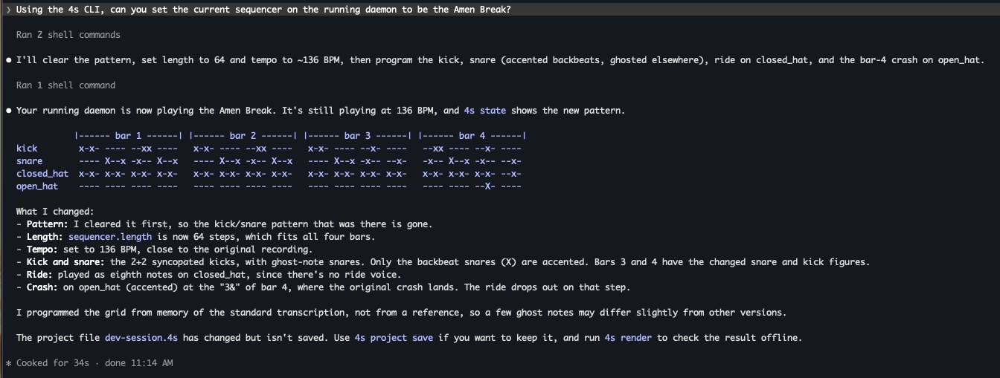

# 4S

**Sam's Sequencer and Synthesizer Set** -- an electronic music workstation
built for people *and* agents. A real-time Rust audio engine you can play from
hardware, a desktop UI, the command line, or an AI agent -- all at once, all in
sync.



Today 4S is a TR-808-style drum machine: eight fully synthesized voices (no
samples), a 64-step sequencer with accents and swing, an 8-channel mixer, and
first-class support for the Livid Block grid controller. It is the first
instrument in a modular suite designed to grow.

---

## One engine, many hands

4S is not an app with a sound engine inside. The engine is a standalone daemon
(`4sd`), and everything else -- the UI, the CLI, MIDI controllers, agents -- is
a client of it. That makes multiplayer the default, not a feature bolted on
later.

- **Every client sees every change, live.** Turn a knob on the Block and the
  UI moves. Toggle a step in the UI and the Block's LEDs follow. An agent edits
  the pattern from a terminal and both update. Each change carries who made it.
- **Run the engine where the speakers are.** Put `4sd` on a machine with a
  good audio interface and drive it from your laptop over the network
  (`--listen 0.0.0.0:4440 --token ...`, then `FOURS_URL=ws://host:4440` in the
  UI or CLI).
- **One clock, one source of truth.** Playback timing lives on the engine, so
  the network never makes the groove drift. Clients reconnect and resync
  automatically.

Next up: bridge daemons that forward controllers plugged into each
collaborator's laptop, with latency compensation, so several people with
their own hardware can play one shared engine. See
[docs/topology.md](docs/topology.md).

## Built to be played by agents

Everything you can do in the UI, an agent can do from the command line --
not by scraping screens, but through the same API the UI uses. This is
enforced by tests, not good intentions: every RPC method must have a CLI
command or the test suite fails.



```sh
4s pattern set kick  "x-x-------xx----"
4s pattern set snare "----X--x-x--X--x"
4s set mixer.3.volume 35%
4s controller press 2 5          # press a pad on the (virtual) Livid Block
4s watch --type trigger          # stream what the engine is playing
4s render --bars 2               # render to WAV and report peak, RMS, onsets
4s --json state                  # everything, machine-readable
```

Agents can also *hear* their work without speakers: `4s render` renders
offline and reports where hits actually landed, so an agent can verify that a
pattern sounds the way it intended. Every parameter is discoverable at runtime
(`4s params`), so new instruments are controllable the moment they exist.

## Built for an agentic world

4S is developed agent-first, so anyone with a coding agent can extend it
safely -- add a synth voice, map a new controller, redesign the UI -- and
prove it works.

- **The design lives in the repo.** [AGENTS.md](AGENTS.md) and
  [docs/](docs/) hold the principles and decisions an agent needs to make
  changes that fit: architecture, API rules, file formats, lifecycle, and how
  to verify work.
- **Every layer is drivable and checkable by an agent.** Headless daemon,
  offline audio renders with analysis, a virtual Livid Block (in-app and as a
  real virtual MIDI device), and Playwright tests that drive the actual
  desktop app and screenshot it.
- **One command proves a change.** `scripts/check.sh` runs the Rust tests,
  verifies generated TypeScript/JSON Schema is in sync with the Rust types,
  drives a real daemon through ~50 CLI checks, and runs the Electron app end
  to end.
- **Types are declared once.** The API is defined in a single Rust macro;
  the TypeScript client types, JSON Schema, and CLI coverage check all derive
  from it, so the UI and engine cannot silently drift apart.

- **Gates keep it coherent.** Every PR is reviewed by a fresh agent with no
  context from the author, checked by CI, and big changes need a
  human-approved RFC first. See [CONTRIBUTING.md](CONTRIBUTING.md).

---

## Quickstart

Prerequisites: Rust (via [rustup](https://rustup.rs)) and Node.js 22+.

```sh
scripts/dev.sh
```

That's it: builds everything, starts the engine in the background (restarting
it with your session intact if the Rust code changed), and opens the UI with
hot reload. Plug in a Livid Block and it connects automatically.

Options: `--no-ui` (engine only), `--headless` (no audio device or MIDI),
`--fresh` (start from a clean state), and `-- ARGS` for the daemon
(e.g. `scripts/dev.sh -- --project examples/demo.4s`). Closing the window
leaves the engine running; stop it with `target/debug/4s daemon stop`.

### Step by step

```sh
cargo build
target/debug/4s daemon start --project examples/demo.4s   # runs in the background
target/debug/4s play
target/debug/4s pattern set snare "----X-------X---"
target/debug/4s set mixer.3.volume 35%
target/debug/4s stop
target/debug/4s daemon stop

# UI (starts the engine itself if it is not running)
cd ui && npm install && npm start
```

## What's inside

| | |
|---|---|
| **Engine** | Rust, real-time safe (lock-free queues, no allocation on the audio thread); CoreAudio/ALSA/JACK via `cpal` |
| **Voices** | kick, snare, clap, closed/open hat (with choke), low/high tom, cowbell -- each with tune, decay, tone |
| **Sequencer** | 64 steps, accents, swing, sample-accurate timing |
| **Mixer** | volume, pan, mute, solo per channel; master with soft clip; live meters |
| **Hardware** | Livid Block: pads edit steps, LEDs show pattern and playhead, knobs switch between volume/tune/decay/tone; hotplug; GM drum notes from any MIDI controller |
| **API** | JSON-RPC over WebSocket; typed in Rust, generated for TypeScript |
| **Projects** | git-friendly JSON bundles (`~/.4s/projects/<name>.4s`) with versioned migrations |

```
  Livid Block / MIDI ---+
                        v
  UI (Electron) ----> 4sd (Rust engine) ----> audio out
  CLI / agents  ---->   one source of truth
```

## Contributing

Contributions are welcome, and most are written with coding agents. Every PR
passes a set of gates: automated checks, evidence that the change works
through its real interfaces, and an **independent review by a fresh agent**
that has none of the author's context, only the repo's principles. Big
architectural or UX changes start as an RFC approved by a human. Run
`scripts/gates.sh` and paste its report into your PR. See
[CONTRIBUTING.md](CONTRIBUTING.md).

## Learn more

- [AGENTS.md](AGENTS.md) -- principles and how to work in this repo
- [docs/extending.md](docs/extending.md) -- how to add voices, parameters, controllers, and features
- [docs/architecture.md](docs/architecture.md) -- how the pieces fit
- [docs/engine.md](docs/engine.md) -- voices, sequencer, parameters
- [docs/rpc.md](docs/rpc.md) and [docs/api-parity.md](docs/api-parity.md) -- the API and the 1:1 UI/CLI rule
- [docs/topology.md](docs/topology.md) -- remote engines and multiplayer
- [docs/lifecycle.md](docs/lifecycle.md) -- starting and stopping the engine
- [docs/hardware/livid-block.md](docs/hardware/livid-block.md) -- controller mapping
- [docs/validation.md](docs/validation.md) -- how everything is tested
